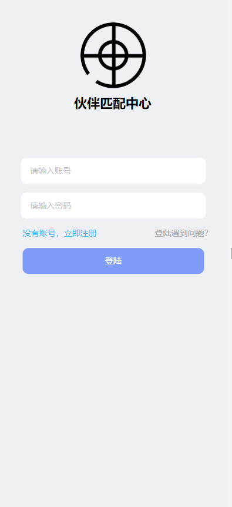
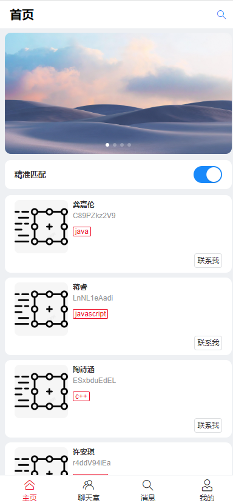
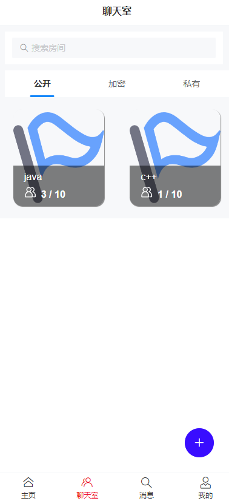
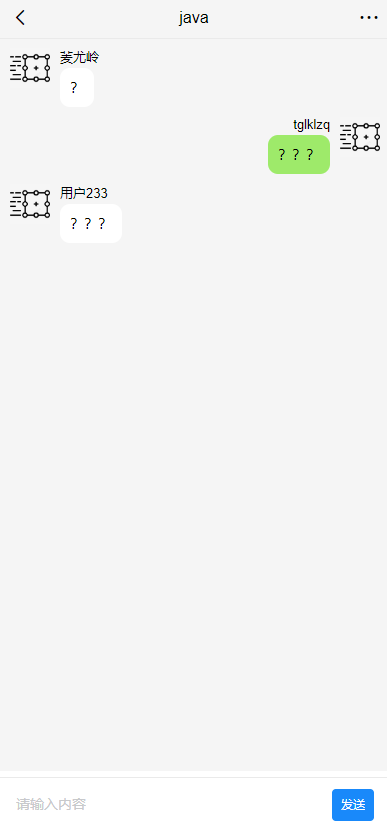
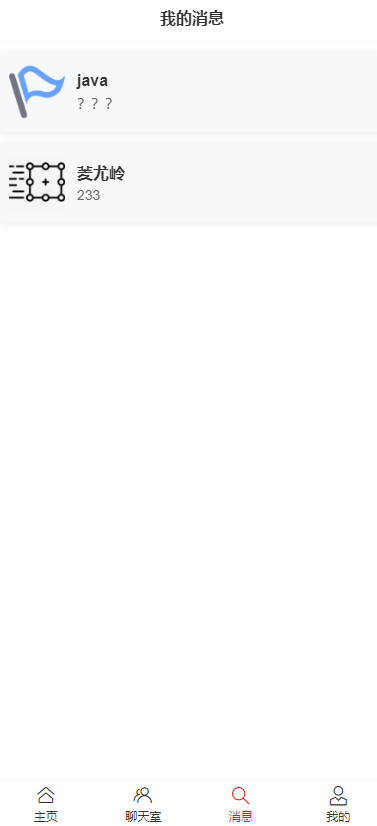
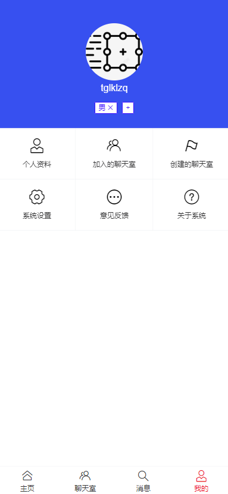

* # 伙伴匹配系统
后端代码：https://github.com/tglklzq/PartnerMatch-backend
* ## 项目简介
    匹配伙伴或组建群聊，让大致相同的志向伙伴聚会一起交流。
* ## 核心功能
    * 1.用户注册登录：用户可以进行注册和登录该系统
    * 2.匹配伙伴：用户可以根据编辑自己的标签，根据标签进行匹配大致符合的伙伴，也可以精准匹配与同一城市的伙伴。
    * 3.用户交流：用户可以发送消息，与伙伴进行交流。也可以创建群聊，邀请伙伴加入，也可以加入已有的群聊。
    * todo 用户管理
* ## 技术选用
* Vite + Vue3 + Vant4
* Axios
* ## 效果预览
  ### 登录界面：

  ### 主页：

  ### 聊天室：

  ### 消息列表

  ### 我的
